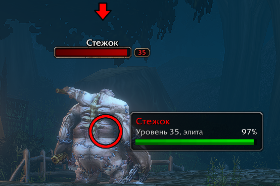
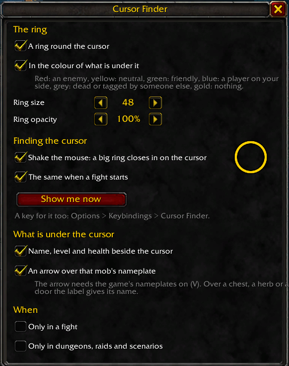

# Cursor Finder

A World of Warcraft addon that keeps the mouse cursor in sight in a crowded fight, and shows what it points at.

In a dungeon pull with a dozen mobs on screen the cursor is easy to lose. Cursor Finder puts a ring round it,
brings it back into view with a shake of the mouse, and names the mob under it.

## Features

- **A ring round the cursor**, in the colour of what is under it: red for an enemy, yellow for neutral, green for
  friendly, light blue for a player on your side, grey for the dead or a mob someone else has tagged, gold over
  nothing. Size and opacity are adjustable.
- **Find the cursor**: shake the mouse left and right and a big ring closes in on the cursor. The same happens when a
  fight starts, or on a key of your choice.
- **What is under the cursor**: the name, level, rank (elite, rare, boss) and health of the unit under the cursor
  beside it, and whether it is your target. Over a chest, a herb or a door, its name.
- **An arrow over the mob** you point at, bobbing above its nameplate (needs the game's nameplates on).
- **Only when you need it**: all of it can be limited to fights, or to dungeons, raids and scenarios.
- Hides while you turn the camera with a mouse button held, as the cursor itself does.
- Blizzard's own look: the default interface's windows, buttons and colours, so it fits any UI.

## Installation

Copy the `CursorFinder` folder into `World of Warcraft/<client>/Interface/AddOns/` and restart the game. The folder
must be named `CursorFinder`.

## Usage

- **Minimap button** (spyglass): click for the settings window, right-click to turn the ring on or off, drag to move
  it round the minimap.
- **Options → AddOns → Cursor Finder**: the same window, and the minimap button on or off.
- **Key binding**: Options → Keybindings → Cursor Finder → *Find the cursor*.

| Command | What it does |
| --- | --- |
| `/cursorfinder` (or `/cfind`) | Opens the settings window |
| `/cursorfinder find` | Shows where the cursor is |
| `/cursorfinder on` / `off` | Turns the ring on or off |
| `/cursorfinder minimap` | Shows or hides the minimap button |
| `/cursorfinder why` | Prints why the ring is shown or hidden right now (for bug reports) |

Settings are saved per account in `CursorFinderDB`.

## Compatibility

Made for the **WoW Forever** beta client (Interface 16001), which runs the retail-family UI with *secret values*:
in some content the game hides a unit's name, health or other details from addons. Cursor Finder never reads those
values. It hands them straight to the game's own text and bar widgets, so the label still shows them where the game
allows. Where it doesn't, the label simply shows less, and the ring keeps working whatever the game hides.

Other clients are untested.

## Development

- `tools/deploy.sh` syntax-checks the Lua (with `luajit`, if installed) and copies the addon into a client's AddOns
  folder. Set `WOW_ADDONS` to that folder, or put `WOW_ADDONS="..."` in `tools/deploy.local`, which git ignores.
- `tools/make_media.py` redraws the two textures in `Media/` (Python 3, no dependencies).

## License

[MIT](LICENSE) © oh-mywow
